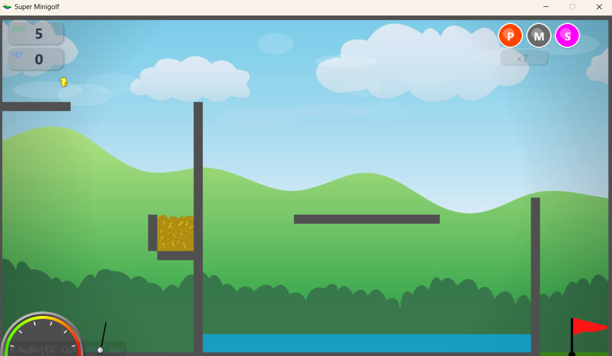

# 🏌️ Super Minigolf

Um jogo de golf 2D completo desenvolvido em Python com Pygame, apresentando física realista, power-ups, sistema de loja e sistema de áudio completo!




---

## 🎮 Como Jogar

### Controles Básicos
| Tecla/Ação | Função |
|------------|--------|
| **Mouse** | Mirar a direção do tiro |
| **Clique** | Definir força do tiro (use o medidor) |
| **A** | Configurações de áudio |
| **ESC** | Sair do jogo |
| **SPACE** | Pular para o placar |

### Power-ups
| Power-up | Tecla | Efeito |
|----------|-------|--------|
| Power Ball | **P** | Força 1.5x maior |
| Sticky Ball | **S** | Bola gruda em superfícies |
| Mullagain | **M** | Desfaz o último tiro |

### Objetivos
- Complete os 9 buracos com o menor número de tacadas
- Colete moedas para desbloquear bolas personalizadas
- Tente fazer "Hole in One"!
- Evite obstáculos como água, laser e areia

---

## ✅ Funcionalidades Implementadas

### 🎮 Gameplay Core
- ✅ Sistema de física com trajetória parabólica
- ✅ 9 níveis únicos com dificuldade crescente
- ✅ Sistema de mira visual com linha de ângulo
- ✅ Medidor de força para tacadas
- ✅ Sistema de putting no green
- ✅ Detecção de colisão com objetos

### 🏆 Sistema de Pontuação
- ✅ Terminologia completa de golf
  - Hole in One, Albatross, Eagle, Birdie, Par, Bogey, Double Bogey, Triple Bogey
- ✅ Placar detalhado por buraco
- ✅ Salvamento automático de melhor pontuação

### ⚡ Power-ups
- ✅ 3 tipos de power-ups estratégicos
- ✅ Limite de 3 power-ups por rodada
- ✅ Feedback visual de power-up ativo

### 👤 Sistema de Login e Perfis
- ✅ Login com nome de jogador
- ✅ Persistência de progresso por perfil
- ✅ Sistema de moedas persistente por jogador

### 🎲 Modo Seed
- ✅ Geração procedural de níveis
- ✅ Seed determinístico (mesmo seed = mesmo nível)
- ✅ Infinitas variações de cursos

### 🛒 Sistema de Loja
- ✅ 16 cores diferentes de bolas
- ✅ Sistema de moedas como currency
- ✅ Compra e equipamento de bolas
- ✅ Persistência de compras

### 🎵 Sistema de Áudio
- ✅ Música de fundo em loop
- ✅ Efeitos sonoros para todas as ações:
  - 🎯 Som de putt ao dar tacadas
  - 💧 Som de splash ao cair na água
  - 🏖️ Som de colisão com areia
  - 🪙 Som ao coletar moedas
  - 🕳️ Som especial ao fazer buraco
  - ⚠️ Som de erro
- ✅ Controles de volume independentes (música/SFX)
- ✅ Menu de configurações de áudio (Tecla A)

### Controles de Áudio
| Tecla | Função |
|-------|--------|
| **A** | Abrir menu de áudio |
| **S** | Ligar/Desligar som |
| **M** | Aumentar volume música |
| **N** | Diminuir volume música |
| **F** | Aumentar volume SFX |
| **G** | Diminuir volume SFX |
| **ESC** | Fechar menu |

---

## 🚀 Instalação e Execução

### Requisitos
- Python 3.6+
- Pygame (instalado automaticamente)

### Como Executar
```bash
python main.py
```

O jogo irá:
1. ✅ Instalar automaticamente o Pygame se necessário
2. ✅ Inicializar o sistema de áudio
3. ✅ Carregar todos os recursos (imagens, sons, níveis)
4. ✅ Iniciar com a tela de menu principal

---

## 📁 Estrutura do Projeto

```
Golf-Game/
├── main.py              # Arquivo principal do jogo
├── physics.py           # Sistema de física
├── courses.py           # Definição dos 9 níveis
├── startScreen.py       # Tela inicial e loja
├── ui_style.py          # Sistema de UI premium (cores, fontes, componentes)
├── profiles.py          # Persistência de perfis de jogador (JSON)
├── level_generator.py   # Geração procedural de níveis (modo seed)
├── scores.txt           # Salvamento de progresso
├── profiles.json        # Dados dos perfis de jogadores
├── CLAUDE.md            # Instruções para o assistente de IA
├── ToDo.md              # Tracker de features e melhorias
├── README.md            # Este arquivo
├── img/                 # Sprites e imagens
│   ├── back.png         # Fundo do jogo
│   ├── title.png        # Logo do título
│   ├── flag.png         # Bandeira/buraco
│   ├── sand.png         # Textura de areia
│   ├── water.png        # Textura de água
│   ├── laser.png        # Obstáculo laser
│   ├── power.png        # Medidor de força
│   ├── coin*.png        # Sprites animados de moedas
│   └── ...              # Outros assets
└── sounds/              # Arquivos de áudio
    ├── music.mp3        # Música de fundo
    ├── putt.wav         # Som de tacada
    ├── inHole.wav       # Som de buraco
    ├── splash.wav       # Som de água
    └── wrong12.wav      # Som de erro
```

---

## 📊 Estatísticas do Jogo

| Categoria | Quantidade |
|-----------|------------|
| Níveis | 9 únicos |
| Bolas personalizáveis | 16 cores |
| Power-ups | 3 tipos |
| Efeitos sonoros | 5+ |
| Obstáculos | 4 tipos |
| Perfis de jogador | Ilimitados |

---

## 🎯 Roadmap de Melhorias

O projeto está passando por uma grande atualização visual e de UX. Consulte o arquivo **[ToDo.md](ToDo.md)** para detalhes completos.

### ✅ Etapa 1 - Base Visual (CONCLUÍDA)
- [x] Tipografia premium (substituiu Comic Sans por fontes modernas)
- [x] HUD moderno com cards glassmorphism
- [x] Gradientes no céu e cenário
- [x] Sombras em todos os elementos
- [x] Bola premium com highlight e sombra
- [x] Vinheta nas bordas da tela
- [x] Loja modernizada com cards e botões pill

### ✅ Etapa 2 - Polish Visual (CONCLUÍDA)
- [x] Sistema de parallax (3 camadas de nuvens)
- [x] Sistema de partículas (ParticleSystem)
- [x] Splash de água com partículas
- [x] Sparkle ao coletar moedas
- [x] Trail da bola em movimento
- [x] Botões com estados hover/pressed

### ✅ Etapa 3 - Apple Arcade Vibe (CONCLUÍDA)
- [x] Transições fade entre telas
- [x] Sistema de confetti para celebrações
- [x] Bandeira com animação de vento
- [x] Camera shake para impactos fortes
- [x] Screen flash para feedback de celebração
- [x] Texturas procedurais de materiais (Metal, Madeira, Pedra)
- [x] Física da bola com Squash & Stretch
- [x] Partículas de poeira em impactos e lançamentos

### ✨ Etapa 4 - Polimento Final & UI (CONCLUÍDA)
- [x] Tela de "Course Completed" com tipografia Apple-style
- [x] Overlay escuro para legibilidade de texto
- [x] Correção de bugs de fechamento (sys.exit)
- [x] Animação contínua na tela de vitória

### ✅ Etapa 5 - Login, Perfis & Modo Seed (CONCLUÍDA)
- [x] Sistema de login/logout de jogador
- [x] Persistência de perfis (JSON)
- [x] Sistema de moedas com persistência por perfil
- [x] Modo seed (geração procedural de níveis)

## 🔧 Melhorias Técnicas
- [x] Asset Manager centralizado para carregamento eficiente
- [x] Sistema de Configurações (Config) para preferências
- [x] Otimização de renderização com cache de texturas

### Funcionalidades Futuras
- [ ] Sistema de tutorial
- [ ] Modo multiplayer local
- [ ] Editor de níveis
- [ ] Mais níveis (18+ buracos)
- [ ] Sistema de conquistas

---

## 🤝 Contribuição

Contribuições são bem-vindas! Sinta-se à vontade para:
- Reportar bugs
- Sugerir novas features
- Enviar pull requests

---

## 📄 Licença

Este projeto está sob a licença MIT. Veja o arquivo LICENSE para mais detalhes.

---

**Divirta-se jogando Super Minigolf!** 🏌️⛳

*Desenvolvido com ❤️ em Python + Pygame*

*Última atualização: Março 2026*
